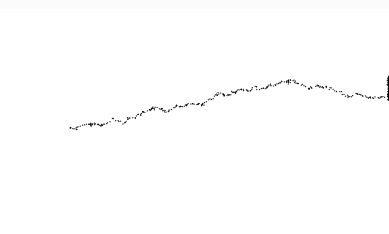

#### Diferencia entre distribuciones uniformes y no uniformes:
Distribución uniforme: Diría que es cuando todos los valores tienen la misma probabilidad de ocurrir. Es como imaginar que estás lanzando un dado: cada número tiene la misma chance de salir. Es como elegir al azar entre 
varias opciones sin que ninguna sea más probable que otra.

Distribución no uniforme: Aquí, algunos valores tienen más probabilidad de aparecer que otros. Por ejemplo, en una distribución normal, la mayoría de los valores están cerca de un valor central. 
Cuanto más te alejas de ese valor, menos probable es que ocurra. Es como si lanzaras una moneda, pero las probabilidades de caer en "cara" fueran mucho más altas que en "cruz".

``` js
class Walker {
  constructor() {
    this.x = width / 2; // Empieza en el centro
    this.y = height / 2;
  }

  show() {
    stroke(0); // Color negro para el punto
    point(this.x, this.y); // Dibuja el punto donde está el caminante
  }

  step() {
    // Aquí usamos una distribución normal para movernos hacia la derecha más
    let xstep = randomGaussian(1, 1); // Media 1, para movernos más a la derecha
    let ystep = randomGaussian(0, 1); // Media 0, para no movernos mucho arriba o abajo

    this.x += xstep; // Añade el paso a la posición x
    this.y += ystep; // Añade el paso a la posición y

    this.x = constrain(this.x, 0, width); // Asegura que no se salga de la pantalla
    this.y = constrain(this.y, 0, height); // Hace lo mismo para el eje y
  }
}

let walker;

function setup() {
  createCanvas(640, 240);
  walker = new Walker();
  background(255); // Fondo blanco
}

function draw() {
  walker.step(); // El caminante da un paso
  walker.show(); // El caminante se dibuja en su nueva posición
}

```

#### Resultado de la simulación

