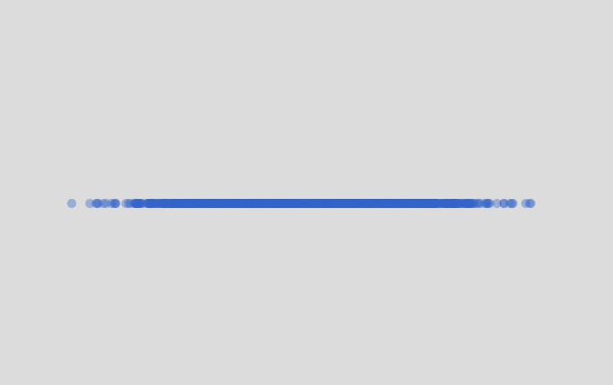

#### Distribución Normal

``` js
function setup() {
  createCanvas(600, 400);
  background(220);
}

function draw() {
  noStroke();
  fill(50, 100, 200, 100); // Color azul semitransparente
  
  let mean = width / 2;  // La media en el centro del lienzo
  let sd = 60;           // Desviación estándar
  
  let x = randomGaussian(mean, sd);
  let y = height / 2; // Coloca los puntos en una línea horizontal
  
  circle(x, y, 8);
}

```

#### Resultado de la simulación


#### Explicación

Este código crea puntos en la pantalla usando números aleatorios, pero en lugar de estar repartidos por todos lados, la mayoría aparecen cerca del centro. 
Esto pasa porque usamos randomGaussian(), que hace que los números generados sigan una distribución normal (en forma de campana).

En la práctica, esto significa que los puntos estarán más concentrados en el centro y habrá menos en los lados, como si estuvieran "amontonados" en el medio. 
Esto es diferente a una distribución uniforme, donde los puntos estarían repartidos por toda la pantalla de manera más pareja.
