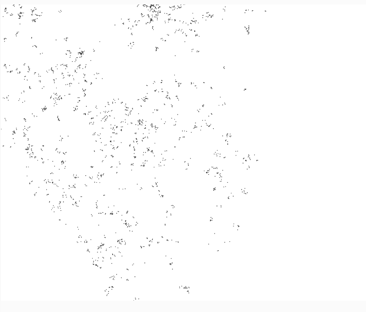

#### ¿Qué es un Lévy Flight y para qué sirve?

Un Lévy Flight es un tipo de movimiento aleatorio donde hay muchos pasos pequeños y, de vez en cuando, un salto grande. 
Es diferente a la caminata aleatoria normal porque no todos los pasos son iguales. Esto es útil en situaciones como la búsqueda de comida de algunos 
animales o en los movimientos de exploración de ciertos algoritmos.

``` js
let walker;

function setup() {
  createCanvas(640, 480);
  walker = new Walker();
  background(255);
}

function draw() {
  walker.step();
  walker.show();
}

class Walker {
  constructor() {
    this.x = width / 2;
    this.y = height / 2;
  }

  show() {
    stroke(0);
    point(this.x, this.y);
  }

  step() {
    let stepSize = this.levy();
    let angle = random(TWO_PI);
    this.x += cos(angle) * stepSize;
    this.y += sin(angle) * stepSize;
  }

  levy() {
    let r = pow(random(1), -1.5); // Genera pasos cortos con algunos saltos largos
    return constrain(r, 1, 50); // Limita los pasos para que no sean demasiado grandes
  }
}

```

#### Resultado de la simulación

