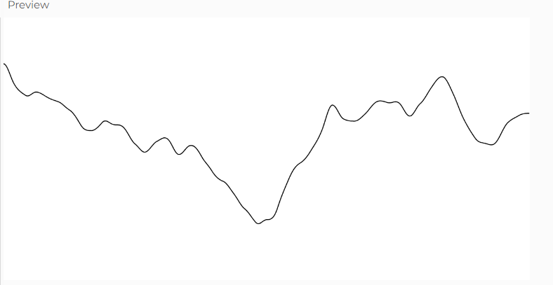

#### Ruido Perlin

#### Explicación de la figura 0.4

En la figura se pueden ver dos graficas distintas, que desde mi punta representan lo siguiente:
-El de la izquierda usa ruido Perlin. Se nota que los cambios son más suaves y progresivos, como si estuviera siguiendo una especie de camino.
-El de la derecha usa valores aleatorios normales. Los cambios son bruscos, sin relación con los valores anteriores.
Básicamente, el ruido Perlin genera transiciones suaves y continuas, mientras que los valores aleatorios normales saltan de un punto a otro sin seguir un patrón.

#### Cómo usé el ruido Perlin
Para generar variaciones suaves, usé la función noise(), que da valores entre 0 y 1, pero cambia de manera progresiva. 
Con eso, podemos hacer cosas como paisajes con colinas suaves, movimientos de cámara fluidos o incluso animaciones naturales.

``` js
let xoff = 0;  // Variable para el ruido Perlin

function setup() {
  createCanvas(600, 300);
}

function draw() {
  background(255);
  stroke(0);
  noFill();
  
  beginShape();
  for (let x = 0; x < width; x++) {
    let y = noise(xoff) * height;  // Genera valores suaves con noise()
    vertex(x, y);
    xoff += 0.01;  // Controla la suavidad de los cambios
  }
  endShape();
}

```

#### Resultado de la simulación

