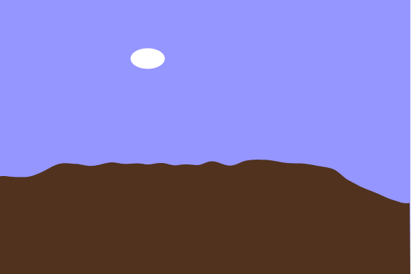

#### Materialización

``` js
let t = 0; // Tiempo para el ruido Perlin
let cloudX = 100;
let cloudY = 50;

function setup() {
  createCanvas(600, 400);
  noStroke();
}

function draw() {
  // Color del cielo basado en distribución normal
  let skyColor = color(100 + randomGaussian(50, 20), 150, 255);
  background(skyColor);
  
  // Dibujar montañas con ruido Perlin
  fill(80, 50, 30);
  beginShape();
  for (let x = 0; x < width; x++) {
    let y = map(noise(t + x * 0.005), 0, 1, height / 2, height - 50);
    if (mouseIsPressed) y -= 20; // Interacción con el mouse
    vertex(x, y);
  }
  vertex(width, height);
  vertex(0, height);
  endShape(CLOSE);
  
  // Movimiento de la nube con Lévy Flight
  cloudX += randomGaussian(2, 5); 
  cloudY += randomGaussian(0, 1); 
  fill(255);
  ellipse(cloudX, cloudY, 50, 30);
  
  // Resetear nube si sale de la pantalla
  if (cloudX > width) {
    cloudX = 0;
    cloudY = random(50, 100);
  }
  
  t += 0.01;
}

```

#### Resultado de la simulación


#### Explicación de los Cambios

Inicialmente, quería usar el ruido Perlin solo para el terreno, pero después agregué un cambio con el mouse para hacerlo más interactivo.
También ajusté el movimiento de la nube con Lévy Flight para que no se desplazara demasiado erráticamente.
