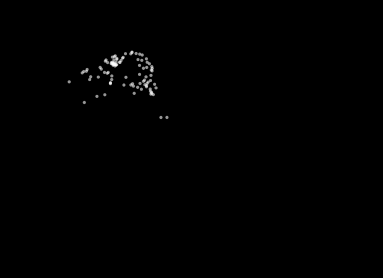

#### Materialización

``` js
let particles = [];
let mode = 1; // 1: constante, 2: aleatoria, 3: hacia el mouse

function setup() {
  createCanvas(windowWidth, windowHeight);
  for (let i = 0; i < 100; i++) {
    particles.push(new Particle(random(width), random(height)));
  }
}

function draw() {
  background(0);
  for (let p of particles) {
    p.update();
    p.show();
  }
}

function keyPressed() {
  if (key === '1') mode = 1;
  if (key === '2') mode = 2;
  if (key === '3') mode = 3;
}

class Particle {
  constructor(x, y) {
    this.position = createVector(x, y);
    this.velocity = createVector(random(-1, 1), random(-1, 1));
    this.acceleration = createVector(0, 0);
  }

  update() {
    if (mode === 1) {
      this.acceleration = createVector(0.01, -0.01); // Aceleración constante
    } else if (mode === 2) {
      this.acceleration = p5.Vector.random2D().mult(0.02); // Aceleración aleatoria
    } else if (mode === 3) {
      let mouse = createVector(mouseX, mouseY);
      this.acceleration = p5.Vector.sub(mouse, this.position).setMag(0.05); // Aceleración hacia el mouse
    }
    
    this.velocity.add(this.acceleration);
    this.velocity.limit(2);
    this.position.add(this.velocity);
    this.edges();
  }

  edges() {
    if (this.position.x > width) this.position.x = 0;
    if (this.position.x < 0) this.position.x = width;
    if (this.position.y > height) this.position.y = 0;
    if (this.position.y < 0) this.position.y = height;
  }

  show() {
    noStroke();
    fill(255, 150);
    ellipse(this.position.x, this.position.y, 5);
  }
}

```

#### Resultado de la simulación


#### Explicación del código:

- Se crean 100 partículas que se mueven en la pantalla.

- Se puede cambiar entre tres modos presionando 1, 2 o 3 en el teclado.

  1: Aceleración constante en una dirección fija.

  2: Aceleración aleatoria en cada frame.

  3: Aceleración dirigida hacia la posición del mouse.

- Límites de la pantalla: Las partículas reaparecen al otro lado cuando salen de los bordes.
