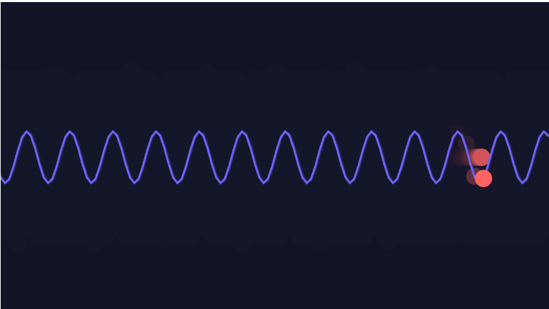

#### Link de la simulación:

https://editor.p5js.org/Ataraxia204/sketches/ZaPAfefje

#### Explicación rápida

- La onda cambia de color según la altura de la oscilación.

- Un círculo sigue la forma de la onda, simulando un movimiento más natural.

- Los controles permiten cambiar la amplitud , el periodo y la fase en tiempo real

  - Flechas izquierda/derecha: Cambian el periodo (hacen la onda más ancha o estrecha).
  - Flechas arriba/abajo: Cambian la amplitud (hacen la onda más alta o baja).
  - Tecla "P": Cambia la fase (desplaza la onda hacia adelante).


 ``` js
let amplitude = 100; // Altura de la onda
let period = 100; // Ancho de la onda (afecta frecuencia)
let phase = 0; // Desfase de la onda
let ballX = 0; // Posición del círculo en la onda

function setup() {
  createCanvas(640, 360);
}

function draw() {
  background(20, 20, 40, 50); // Fondo oscuro con rastro

  strokeWeight(2);
  noFill();
  
  translate(0, height / 2); // Centrar la onda

  let ballY = 0;
  
  beginShape();
  for (let x = 0; x < width; x += 5) {
    let angle = (TWO_PI * x) / period + phase;
    let y = amplitude * sin(angle);

    // Cambio de color según la amplitud
    stroke(map(y, -amplitude, amplitude, 100, 255), 100, 255);
    vertex(x, y);

    // Guardar la posición de la bola en la onda
    if (x === ballX) {
      ballY = y;
    }
  }
  endShape();

  // Dibujar la bola que sigue la onda
  fill(255, 100, 100);
  noStroke();
  circle(ballX, ballY, 20);

  // Mover la bola a través de la onda
  ballX += 2;
  if (ballX > width) {
    ballX = 0;
  }
  
  phase += 0.02; // Movimiento continuo de la onda
}

// Controles para modificar la onda en tiempo real
function keyPressed() {
  if (keyCode === UP_ARROW) {
    amplitude += 10;
  } else if (keyCode === DOWN_ARROW) {
    amplitude = max(10, amplitude - 10);
  } else if (keyCode === LEFT_ARROW) {
    period = max(20, period - 10);
  } else if (keyCode === RIGHT_ARROW) {
    period += 10;
  } else if (key === 'P' || key === 'p') {
    phase += PI / 8;
  }
}

```


#### Resultado de la simulación

