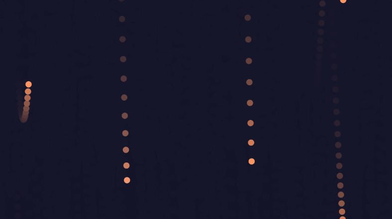

#### Link de la simulación:

https://editor.p5js.org/Ataraxia204/sketches/QpYYaSWus


``` js
let particles = [];
let wind;

function setup() {
  createCanvas(640, 360);
  for (let i = 0; i < 10; i++) {
    particles.push(new Particle(random(width), random(height / 2))); // Crear partículas con posiciones aleatorias
  }
  wind = createVector(0.01, 0); // Viento más suave
}

function draw() {
  background(20, 20, 40, 50);

  for (let p of particles) {
    let gravity = createVector(0, 0.02); // Gravedad más ligera
    let randomWind = wind.copy().mult(random(0.8, 1.2)); // Pequeña variación en el viento
    p.applyForce(gravity);
    p.applyForce(randomWind);
    p.update();
    p.display();
  }
}

class Particle {
  constructor(x, y) {
    this.position = createVector(x, y);
    this.velocity = createVector(random(-0.5, 0.5), random(-0.5, 0.5)); // Velocidad inicial más baja
    this.acceleration = createVector(0, 0);
    this.amplitude = random(30, 80); // Menos variabilidad en la amplitud
    this.period = random(80, 120); // Periodos más consistentes
    this.phase = random(TWO_PI);
  }

  applyForce(force) {
    this.acceleration.add(force);
  }

  update() {
    this.velocity.add(this.acceleration);
    this.velocity.limit(2); // Limitar la velocidad máxima para evitar movimientos bruscos
    this.position.add(this.velocity);
    this.acceleration.mult(0);

    // Movimiento sinusoidal más estable
    this.position.y += this.amplitude * sin((TWO_PI * frameCount) / this.period + this.phase) * 0.5;

    // Si sale de la pantalla, reaparece suavemente
    if (this.position.x > width) this.position.x = 0;
    if (this.position.x < 0) this.position.x = width;
    if (this.position.y > height) this.position.y = random(height / 2);
  }

  display() {
    fill(lerpColor(color(255, 150, 100), color(100, 150, 255), sin(this.phase)));
    noStroke();
    circle(this.position.x, this.position.y, 10);
  }
}

```

#### Resultado de la simulación

