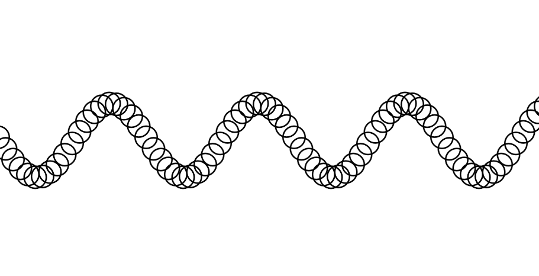

#### Link de la simulación:

https://editor.p5js.org/Ataraxia204/sketches/oEvmSjpmn

``` js
let xspacing = 10;  // Espaciado entre los círculos
let w;  // Ancho total de la onda
let theta = 0.0;  // Ángulo inicial
let amplitude = 50;  // Altura de la onda
let period = 200;  // Periodo de la onda
let dx;  // Incremento de x basado en el periodo
let yvalues;  // Almacena los valores de y para la onda

function setup() {
  createCanvas(800, 400);
  w = width + 16;
  dx = (TWO_PI / period) * xspacing;
  yvalues = new Array(floor(w / xspacing));
}

function calcWave() {
  theta += 0.05;  // Movimiento de la onda

  let x = theta;
  for (let i = 0; i < yvalues.length; i++) {
    yvalues[i] = sin(x) * amplitude;  // Calculamos la posición de cada punto de la onda
    x += dx;
  }
}

function draw() {
  background(255);
  calcWave();
  noFill();  // Círculos sin relleno
  stroke(0);
  strokeWeight(2);

  for (let i = 0; i < yvalues.length; i++) {
    ellipse(i * xspacing, height / 2 + yvalues[i], 30, 30);  // Dibuja la onda con los círculos
  }
}

```

#### Resultado de la simulación

