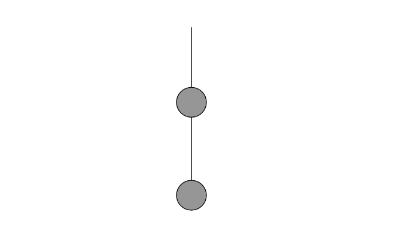

#### Link de la simulación:

https://editor.p5js.org/Ataraxia204/sketches/FLFrYPgYs

``` js
let spring1, spring2;
let bob1, bob2;
let anchor;

function setup() {
  createCanvas(800, 400);
  anchor = createVector(width / 2, 100);

  let len1 = 100;
  let len2 = 100;
  
  bob1 = new Bob(anchor.x, anchor.y + len1, 20);
  bob2 = new Bob(anchor.x, anchor.y + len1 + len2, 20);
  
  spring1 = new Spring(anchor.x, anchor.y, len1);
  spring2 = new Spring(bob1.position.x, bob1.position.y, len2);
}

function draw() {
  background(255);
  
  let gravity = createVector(0, 0.2);

  bob1.applyForce(gravity);
  bob2.applyForce(gravity);
  
  spring1.connect(anchor, bob1);
  spring2.connect(bob1.position, bob2);

  bob1.update();
  bob2.update();

  spring1.display(anchor, bob1);
  spring2.display(bob1.position, bob2);

  bob1.display();
  bob2.display();
}

class Bob {
  constructor(x, y, mass) {
    this.position = createVector(x, y);
    this.velocity = createVector(0, 0);
    this.acceleration = createVector(0, 0);
    this.mass = mass;
  }

  applyForce(force) {
    let f = p5.Vector.div(force, this.mass);
    this.acceleration.add(f);
  }

  update() {
    this.velocity.add(this.acceleration);
    this.position.add(this.velocity);
    this.acceleration.mult(0);
  }

  display() {
    stroke(0);
    fill(150);
    circle(this.position.x, this.position.y, this.mass * 2);
  }
}

class Spring {
  constructor(x, y, length) {
    this.restLength = length;
    this.k = 0.1; 
  }

  connect(a, b) {
    let force = p5.Vector.sub(b.position, a);
    let d = force.mag();
    let stretch = d - this.restLength;
    force.normalize();
    force.mult(-this.k * stretch);
    b.applyForce(force);
  }

  display(a, b) {
    stroke(0);
    line(a.x, a.y, b.position.x, b.position.y);
  }
}

```

#### Resultado de la simulación

