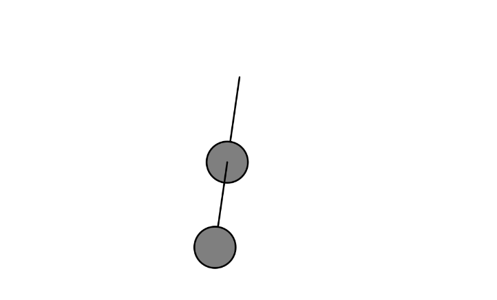

#### Link de la simulación:

https://editor.p5js.org/Ataraxia204/sketches/oC6HK2GdQ

``` js
let pendulum1, pendulum2;

function setup() {
  createCanvas(600, 400);
  pendulum1 = new Pendulum(width / 2, 100, 100);
  pendulum2 = new Pendulum(0, 0, 100); // Se actualizará su pivote en cada frame
}

function draw() {
  background(255);

  pendulum1.update();
  pendulum1.show();

  // El segundo péndulo se ancla al extremo del primero
  pendulum2.pivot.set(pendulum1.bob.x, pendulum1.bob.y);
  pendulum2.update();
  pendulum2.show();
}

class Pendulum {
  constructor(x, y, r) {
    this.pivot = createVector(x, y);
    this.bob = createVector();
    this.r = r;
    this.angle = PI / 4;
    this.angleVelocity = 0;
    this.angleAcceleration = 0;
    this.damping = 0.995; // Amortiguación
    this.ballr = 24;
  }

  update() {
    let gravity = 0.4;
    this.angleAcceleration = ((-1 * gravity) / this.r) * sin(this.angle);
    this.angleVelocity += this.angleAcceleration;
    this.angle += this.angleVelocity;
    this.angleVelocity *= this.damping; // Aplicar amortiguación
  }

  show() {
    this.bob.set(this.r * sin(this.angle), this.r * cos(this.angle), 0);
    this.bob.add(this.pivot);

    stroke(0);
    strokeWeight(2);
    line(this.pivot.x, this.pivot.y, this.bob.x, this.bob.y);
    fill(127);
    circle(this.bob.x, this.bob.y, this.ballr * 2);
  }
}

```
#### Resultado de la simulación

