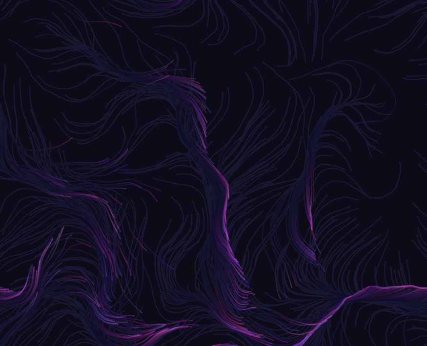

#### Link de la simulación: 

https://editor.p5js.org/Ataraxia204/sketches/Tx4crIUN7

``` js
let particles = [];
let flowField;
let cols, rows;
let scl = 20;
let inc = 0.1;
let zoff = 0;

function setup() {
  createCanvas(windowWidth, windowHeight);
  cols = floor(width / scl);
  rows = floor(height / scl);
  flowField = new Array(cols * rows);
  for (let i = 0; i < 500; i++) {
    particles.push(new Particle());
  }
}

function draw() {
  background(10, 10, 30, 10);
  let xoff = 0;
  for (let x = 0; x < cols; x++) {
    let yoff = 0;
    for (let y = 0; y < rows; y++) {
      let index = x + y * cols;
      let angle = noise(xoff, yoff, zoff) * TWO_PI * 2;
      let v = p5.Vector.fromAngle(angle);
      v.setMag(0.5);
      flowField[index] = v;
      yoff += inc;
    }
    xoff += inc;
  }
  zoff += 0.002;

  for (let particle of particles) {
    particle.follow(flowField);
    particle.update();
    particle.show();
  }
}

function mouseDragged() {
  for (let i = 0; i < 10; i++) {
    particles.push(new Particle(mouseX, mouseY));
  }
}

class Particle {
  constructor(x, y) {
    this.pos = createVector(x || random(width), y || random(height));
    this.vel = createVector(0, 0);
    this.acc = createVector(0, 0);
    this.maxSpeed = 2;
    this.color = color(random(50, 255), random(20, 100), random(100, 255), 100);
  }
  follow(vectors) {
    let x = floor(this.pos.x / scl);
    let y = floor(this.pos.y / scl);
    let index = x + y * cols;
    let force = vectors[index];
    this.applyForce(force);
  }
  applyForce(force) {
    this.acc.add(force);
  }
  update() {
    this.vel.add(this.acc);
    this.vel.limit(this.maxSpeed);
    this.pos.add(this.vel);
    this.acc.mult(0);
    if (this.pos.x > width) this.pos.x = 0;
    if (this.pos.x < 0) this.pos.x = width;
    if (this.pos.y > height) this.pos.y = 0;
    if (this.pos.y < 0) this.pos.y = height;
  }
  show() {
    stroke(this.color);
    strokeWeight(2);
    point(this.pos.x, this.pos.y);
  }
}

```

#### Resultado de la simulación

