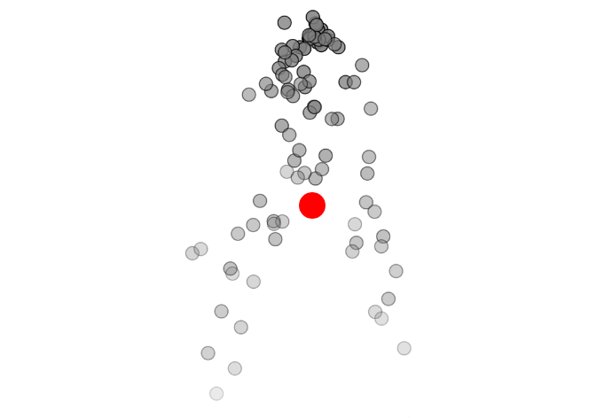

### Ejemplo 4.2: an Array of Particles.

#### Concepto agregado: Oscilación
Aplicamos una oscilación en el color de las partículas para hacerlo más expresivo visualmente. Además, gestionamos la memoria eliminando las partículas cuando su "vida útil" termina.

#### Explicación:
Creación: cada vez que se llama a draw(), se crea una nueva partícula en la posición del mouse.

- Desaparición: las partículas tienen una vida útil (lifespan) que se reduce con el tiempo. Cuando llega a cero, se eliminan del array.

- Memoria: al hacer splice(i, 1), evitamos que las partículas muertas sigan ocupando memoria.

- Concepto aplicado (Unidad 1 - Oscilación): usamos una función seno para hacer que el color de la partícula oscile con el tiempo, generando un efecto visual dinámico.

#### Codigo:
``` js
  let particles = [];

function setup() {
  createCanvas(600, 400);
}

function draw() {
  background(20, 20, 40, 50);

  particles.push(new Particle(createVector(mouseX, mouseY)));

  for (let i = particles.length - 1; i >= 0; i--) {
    let p = particles[i];
    p.update();
    p.display();
    if (p.isDead()) {
      particles.splice(i, 1);
    }
  }
}

class Particle {
  constructor(position) {
    this.position = position.copy();
    this.velocity = createVector(random(-1, 1), random(-2, 0));
    this.acceleration = createVector(0, 0.05);
    this.lifespan = 255;
    this.oscillationAngle = random(TWO_PI); // para color oscilante
  }

  update() {
    this.velocity.add(this.acceleration);
    this.position.add(this.velocity);
    this.lifespan -= 2;
    this.oscillationAngle += 0.1;
  }

  display() {
    let oscColor = map(sin(this.oscillationAngle), -1, 1, 100, 255);
    stroke(oscColor, 200, 255, this.lifespan);
    fill(oscColor, 100, 255, this.lifespan);
    ellipse(this.position.x, this.position.y, 12);
  }

  isDead() {
    return this.lifespan < 0;
  }
}

```

#### Link de simulación:
https://editor.p5js.org/Ataraxia204/sketches/oXLJtoqvR

#### Resultado de la simulación


### Ejemplo 4.4: a System of Systems.

#### Gestión de creación y desaparición de partículas
Las partículas se crean continuamente y se almacenan en un arreglo. Cada partícula tiene un atributo lifespan, que se va reduciendo en cada ciclo. Cuando lifespan es menor a 0, se considera “muerta” y se elimina del arreglo (con splice). Esto permite liberar memoria evitando que el array crezca indefinidamente.

#### Concepto aplicado: Unidad 1 – Aleatoriedad
Implementé la aleatoriedad para que las partículas cambien de tamaño de manera dinámica y visualmente interesante. Esto lo apliqué solo a las CrazyParticle, para enfatizar su comportamiento excéntrico.

#### Codigo:

``` js
let systems = [];

function setup() {
  createCanvas(600, 400);
}

function draw() {
  background(255);
  for (let i = 0; i < systems.length; i++) {
    systems[i].addParticle();
    systems[i].run();
  }
}

function mousePressed() {
  systems.push(new ParticleSystem(createVector(mouseX, mouseY)));
}

class ParticleSystem {
  constructor(position) {
    this.origin = position.copy();
    this.particles = [];
  }

  addParticle() {
    if (random(1) < 0.5) {
      this.particles.push(new Particle(this.origin));
    } else {
      this.particles.push(new CrazyParticle(this.origin));
    }
  }

  run() {
    for (let i = this.particles.length - 1; i >= 0; i--) {
      let p = this.particles[i];
      p.run();
      if (p.isDead()) {
        this.particles.splice(i, 1);
      }
    }
  }
}

class Particle {
  constructor(position) {
    this.position = position.copy();
    this.velocity = createVector(random(-1, 1), random(-2, 0));
    this.acceleration = createVector(0, 0.05);
    this.lifespan = 255.0;
  }

  run() {
    this.update();
    this.display();
  }

  update() {
    this.velocity.add(this.acceleration);
    this.position.add(this.velocity);
    this.lifespan -= 2.0;
  }

  display() {
    stroke(0, this.lifespan);
    fill(127, this.lifespan);
    ellipse(this.position.x, this.position.y, 12, 12);
  }

  isDead() {
    return this.lifespan < 0.0;
  }
}

class CrazyParticle extends Particle {
  display() {
    let r = random(5, 20);
    stroke(255, 0, 0, this.lifespan);
    fill(255, 150, 150, this.lifespan);
    ellipse(this.position.x, this.position.y, r, r);
  }
}

```

#### Link de la simulación:
https://editor.p5js.org/Ataraxia204/sketches/ASWeGEHOf

#### Resultado de la simulación


### Ejemplo 4.5: A Particle System with Inheritance and Polymorphism

#### Gestión de creación y desaparición de partículas
Las partículas, tanto normales como de confeti, tienen su propio lifespan. Se almacenan en un arreglo y se eliminan cuando ya no son visibles (lifespan < 0). Así se evita la acumulación de partículas y se libera memoria.

#### Concepto aplicado: Unidad 1 – Aleatoriedad
Modifiqué el sistema para que, al crear cada partícula, haya una probabilidad aleatoria de que sea un Confetti o una Particle. Esto retoma el uso de random() como se enseñó en la Unidad 1.

#### Codigo:

``` js
let ps;

function setup() {
  createCanvas(600, 400);
  ps = new ParticleSystem(createVector(width / 2, 50));
}

function draw() {
  background(255);
  ps.addParticle();
  ps.run();
}

class ParticleSystem {
  constructor(position) {
    this.origin = position.copy();
    this.particles = [];
  }

  addParticle() {
    if (random(1) < 0.5) {
      this.particles.push(new Particle(this.origin));
    } else {
      this.particles.push(new Confetti(this.origin));
    }
  }

  run() {
    for (let i = this.particles.length - 1; i >= 0; i--) {
      let p = this.particles[i];
      p.run();
      if (p.isDead()) {
        this.particles.splice(i, 1);
      }
    }
  }
}

class Particle {
  constructor(position) {
    this.position = position.copy();
    this.velocity = createVector(random(-1, 1), random(-2, 0));
    this.acceleration = createVector(0, 0);
    this.lifespan = 255.0;
  }

  run() {
    this.update();
    this.display();
  }

  update() {
    this.velocity.add(this.acceleration);
    this.position.add(this.velocity);
    this.acceleration.mult(0);
    this.lifespan -= 2.0;
  }

  display() {
    stroke(0, this.lifespan);
    fill(127, this.lifespan);
    ellipse(this.position.x, this.position.y, 12, 12);
  }

  isDead() {
    return this.lifespan < 0.0;
  }
}

class Confetti extends Particle {
  constructor(position) {
    super(position);
  }

  display() {
    rectMode(CENTER);
    fill(255, 0, 0, this.lifespan);
    stroke(0, this.lifespan);
    rect(this.position.x, this.position.y, 8, 8);
  }
}

```

#### Link de la simulación:
https://editor.p5js.org/Ataraxia204/sketches/dUveBgT-4

#### Resultado de la simulación


### Ejemplo 4.6: A Particle System with Forces

#### Gestión de creación y desaparición de partículas
Las partículas se almacenan en un arreglo y cada una tiene un lifespan que se va reduciendo con el tiempo. Cuando su lifespan llega a cero, se eliminan del arreglo con splice, lo que evita saturar la memoria.

#### Concepto aplicado: Unidad 2 – Vectores
En este ejemplo, apliqué un vector de “viento” que cambia su dirección con el tiempo, de forma suave, utilizando sin(frameCount/100). Eso conecta con lo aprendido en la Unidad 2 sobre cómo manipular vectores para generar movimiento más natural.

#### Codigo:

``` js
let ps;

function setup() {
  createCanvas(600, 400);
  ps = new ParticleSystem(createVector(width / 2, 50));
}

function draw() {
  background(255);

  let gravity = createVector(0, 0.1);
  let wind = createVector(sin(frameCount / 100) * 0.1, 0); // viento que cambia suavemente

  ps.addParticle();
  ps.applyForce(gravity);
  ps.applyForce(wind);
  ps.run();
}

class ParticleSystem {
  constructor(position) {
    this.origin = position.copy();
    this.particles = [];
  }

  addParticle() {
    this.particles.push(new Particle(this.origin));
  }

  applyForce(f) {
    for (let p of this.particles) {
      p.applyForce(f);
    }
  }

  run() {
    for (let i = this.particles.length - 1; i >= 0; i--) {
      let p = this.particles[i];
      p.run();
      if (p.isDead()) {
        this.particles.splice(i, 1);
      }
    }
  }
}

class Particle {
  constructor(position) {
    this.position = position.copy();
    this.velocity = createVector(random(-1, 1), random(-2, 0));
    this.acceleration = createVector(0, 0);
    this.lifespan = 255.0;
  }

  applyForce(force) {
    this.acceleration.add(force);
  }

  run() {
    this.update();
    this.display();
  }

  update() {
    this.velocity.add(this.acceleration);
    this.position.add(this.velocity);
    this.acceleration.mult(0); // Resetea la aceleración para el próximo ciclo
    this.lifespan -= 2.0;
  }

  display() {
    stroke(0, this.lifespan);
    fill(127, this.lifespan);
    ellipse(this.position.x, this.position.y, 12, 12);
  }

  isDead() {
    return this.lifespan < 0.0;
  }
}

```
#### Link de la simulación:
https://editor.p5js.org/Ataraxia204/sketches/RaxvatCCj

#### Resultado de la simulación


### Ejemplo 4.7: A Particle System with a Repeller

#### Gestión de creación y desaparición de partículas
Como en los ejemplos anteriores, cada partícula tiene un lifespan que se reduce con el tiempo. Al llegar a cero, la partícula se considera “muerta” y se elimina del array con splice. Esto mantiene la memoria optimizada.

#### Concepto aplicado: Unidad 3 – Funciones y modularidad
El código aprovecha funciones para encapsular la lógica del repeller, como repel(particle), lo que permite separar responsabilidades y hacer el sistema más modular, algo clave de la Unidad 3.

#### Codigo:

``` js
let ps;
let repeller;

function setup() {
  createCanvas(600, 400);
  ps = new ParticleSystem(createVector(width / 2, 50));
  repeller = new Repeller(createVector(width / 2, height / 2));
}

function draw() {
  background(255);

  let gravity = createVector(0, 0.1);
  ps.addParticle();
  ps.applyForce(gravity);
  ps.applyRepeller(repeller);
  ps.run();
  repeller.display();
}

class ParticleSystem {
  constructor(position) {
    this.origin = position.copy();
    this.particles = [];
  }

  addParticle() {
    this.particles.push(new Particle(this.origin));
  }

  applyForce(f) {
    for (let p of this.particles) {
      p.applyForce(f);
    }
  }

  applyRepeller(r) {
    for (let p of this.particles) {
      let force = r.repel(p);
      p.applyForce(force);
    }
  }

  run() {
    for (let i = this.particles.length - 1; i >= 0; i--) {
      let p = this.particles[i];
      p.run();
      if (p.isDead()) {
        this.particles.splice(i, 1);
      }
    }
  }
}

class Particle {
  constructor(position) {
    this.position = position.copy();
    this.velocity = createVector(random(-1, 1), random(-2, 0));
    this.acceleration = createVector(0, 0);
    this.lifespan = 255.0;
    this.mass = 1;
  }

  applyForce(force) {
    let f = p5.Vector.div(force, this.mass);
    this.acceleration.add(f);
  }

  run() {
    this.update();
    this.display();
  }

  update() {
    this.velocity.add(this.acceleration);
    this.position.add(this.velocity);
    this.acceleration.mult(0);
    this.lifespan -= 2.0;
  }

  display() {
    stroke(0, this.lifespan);
    fill(127, this.lifespan);
    ellipse(this.position.x, this.position.y, 12, 12);
  }

  isDead() {
    return this.lifespan < 0.0;
  }
}

class Repeller {
  constructor(position) {
    this.position = position.copy();
    this.power = 100;
  }

  repel(p) {
    let dir = p5.Vector.sub(this.position, p.position);
    let d = dir.mag();
    d = constrain(d, 5, 100);
    dir.normalize();
    let force = -1 * this.power / (d * d);
    dir.mult(force);
    return dir;
  }

  display() {
    noStroke();
    fill(255, 0, 0);
    ellipse(this.position.x, this.position.y, 24, 24);
  }
}

```

#### Link de la simulación: 
https://editor.p5js.org/Ataraxia204/sketches/hKlUnNLHG

#### Resultado de la simulación

