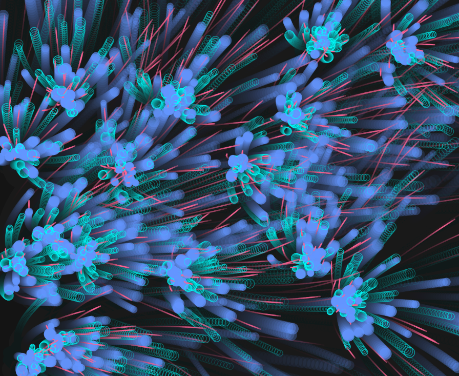

### Obra de arte generativa algorítmica interactiva en tiempo real

#### Link de la simulación:
https://editor.p5js.org/Ataraxia204/sketches/4jPnJHRpN

#### Codigo:

``` js
let systems = [];

function setup() {
  createCanvas(800, 600);
  background(20);
}

function draw() {
  background(20, 20, 20, 25);
  for (let s of systems) {
    s.addParticle();
    s.run();
  }
}

function mousePressed() {
  systems.push(new ParticleSystem(createVector(mouseX, mouseY)));
}

class ParticleSystem {
  constructor(position) {
    this.origin = position.copy();
    this.particles = [];
  }

  addParticle() {
    let choice = int(random(3));
    if (choice === 0) {
      this.particles.push(new InkParticle(this.origin));
    } else if (choice === 1) {
      this.particles.push(new BubbleParticle(this.origin));
    } else {
      this.particles.push(new SmudgeParticle(this.origin));
    }
  }

  run() {
    for (let i = this.particles.length - 1; i >= 0; i--) {
      let p = this.particles[i];
      p.update();
      p.display();
      if (p.isDead()) {
        this.particles.splice(i, 1);
      }
    }
  }
}

class Particle {
  constructor(position) {
    this.position = position.copy();
    this.velocity = p5.Vector.random2D().mult(random(0.5, 2));
    this.acceleration = createVector(0, 0);
    this.lifespan = 255;
    this.size = random(8, 16);
  }

  applyForce(force) {
    this.acceleration.add(force);
  }

  update() {
    let n = noise(this.position.x * 0.005, this.position.y * 0.005);
    let angle = map(n, 0, 1, -PI, PI);
    this.applyForce(p5.Vector.fromAngle(angle).mult(0.05));
    this.velocity.add(this.acceleration);
    this.position.add(this.velocity);
    this.acceleration.mult(0);
    this.lifespan -= 2;
  }

  display() {
    // default style
    noStroke();
    fill(255, this.lifespan);
    ellipse(this.position.x, this.position.y, this.size);
  }

  isDead() {
    return this.lifespan <= 0;
  }
}

class InkParticle extends Particle {
  display() {
    noStroke();
    fill(100, 150, 255, this.lifespan);
    ellipse(this.position.x, this.position.y, this.size * 1.2);
  }
}

class BubbleParticle extends Particle {
  display() {
    noFill();
    stroke(0, 255, 255, this.lifespan);
    strokeWeight(1);
    ellipse(this.position.x, this.position.y, this.size);
  }
}

class SmudgeParticle extends Particle {
  display() {
    stroke(255, 100, 150, this.lifespan);
    strokeWeight(2);
    line(this.position.x, this.position.y, this.position.x + this.velocity.x * 5, this.position.y + this.velocity.y * 5);
  }
}

```

#### Conceptos aplicados
- Unidad 1 (Oscilaciones): las partículas tienen un movimiento ligeramente oscilante que se suma a su dirección, simulando ondulación en el agua.

- Unidad 2 (Ruido): la dirección de algunas partículas se modifica con noise(), logrando un flujo más orgánico.

- Unidad 3 (Visualización de datos): el color de la partícula varía con el tiempo de vida (edad), visualizando el paso del tiempo.

- Unidad 4 (Aleatoriedad controlada): al crear nuevas partículas, se eligen propiedades visuales (color, tamaño) con aleatoriedad, pero dentro de un rango definido.

- Unidad 5 Herencia y Polimorfismo

#### Resultado de la simulación

