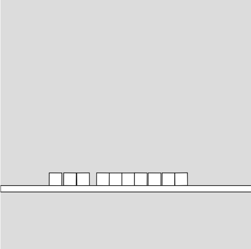
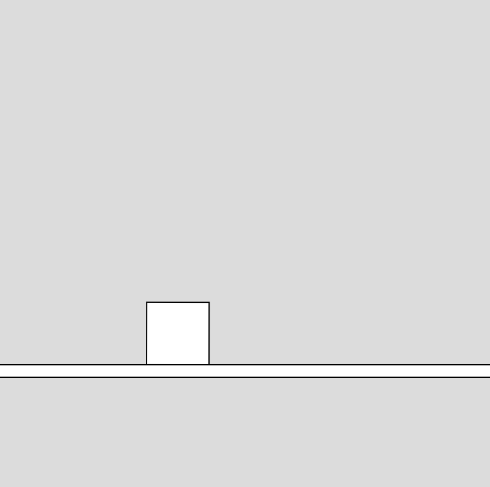

### Visualización y lectura:

Vi el video completo de Patt Vira. La verdad es que explica bastante bien cómo empezar con Matter.js y cómo se conecta con p5.js. Ver los ejemplos de las cajas cayendo y cómo interactúa con el mouse me dio una idea de lo que podemos hacer.
También estuve explorando los demos en la página oficial de Matter.js. ¡Hay cosas súper interesantes! Los de las pilas de objetos, los péndulos y cómo se deforman las figuras son geniales. Me ayudaron a ver el potencial de esta librería.
Identificación de conceptos clave:

Mientras veía los videos y los ejemplos, anoté algunas palabras que parecían importantes: Engine, World, Bodies (y que hay rectángulos, círculos, polígonos), Constraint, MouseConstraint, y también mencionaron algo de Runner y Events. Intenté hacerme una idea de qué significaba cada cosa por el contexto en el que aparecían.
Experimentación con código:

### Experimentación con código:

### Experimento 1: Creación dinámica de cajas con interacción del mouse.

Para este experimento, me basé en el primer código que "escribimos" con el video. La idea principal es crear un mundo con gravedad donde puedo agregar cajas simplemente haciendo clic con el mouse.

``` js
const {Engine, Body, Bodies, Composite} = Matter;

let engine;
let boxes = [];
let ground;

function setup() {
  createCanvas(400, 400);
  engine = Engine.create();
  ground = new Ground(200, 300, 400, 10);
}

function draw() {
  background(220);
  Engine.update(engine);

  for (let i = 0; i < boxes.length; i++) {
    boxes[i].display();
  }
  ground.display();
}

function mousePressed() {
  boxes.push(new Rect(mouseX, mouseY, 20, 20));
}
```

#### Resultado de la simulación


#### Explicación: 
En este código, primero inicializamos el Engine. Luego, creamos un ground estático utilizando la clase Ground que definimos previamente. En la función draw(), actualizamos el Engine para que la física se simule y luego mostramos cada una de las cajas que hemos creado y el suelo, utilizando sus respectivos métodos display(). La función mousePressed() es clave, ya que cada vez que hago clic, crea una nueva instancia de la clase Rect (que representa un cuerpo rectangular con física) en la posición del mouse y la añade al array boxes, lo que hace que aparezca en la simulación.

#### Experimento 2: Un cuerpo rectangular con rotación y un suelo estático.

Para este segundo experimento, utilicé el segundo código que proporcionaste. Aquí, me centré en crear un solo objeto que rota y un suelo estático sobre el que interactúa.

``` js
const { Engine, Bodies, Body, Composite } = Matter

let engine;
let box;
let ground;

function setup() {
  createCanvas(400, 400);
  engine = Engine.create();

  box = Bodies.rectangle(100, 100, 50, 50);
  Body.setAngularVelocity(box, 0.2);

  ground = Bodies.rectangle(200, 300, 400, 10, { isStatic: true });

  Composite.add(engine.world, [box, ground]);
}

function draw() {
  background(220);
  Engine.update(engine);

  push();
  rectMode(CENTER);
  let x = box.position.x;
  let y = box.position.y;
  let angle = box.angle;
  translate(x, y);
  rotate(angle);
  rect(0, 0, 50, 50);
  pop();

  let gp1 = ground.bounds.min.x;
  let gp2 = ground.bounds.min.y;
  let gp3 = ground.bounds.max.x;
  let gp4 = ground.bounds.max.y;

  rectMode(CORNERS);
  rect(gp1, gp2, gp3, gp4);
}
```

#### Resultado de la simulación


#### Explicación: 
En este segundo ejemplo, también inicializamos el Engine. Creamos un único Body rectangular para la caja y utilizamos Body.setAngularVelocity() para darle un movimiento de rotación inicial. Luego, creamos otro Body rectangular para el suelo, pero esta vez con la propiedad isStatic: true para que no se mueva por la gravedad ni por las colisiones. Ambos cuerpos se añaden al engine.world usando Composite.add(). En la función draw(), actualizamos la física y luego utilizamos las funciones de transformación de p5.js (translate() y rotate()) para dibujar la caja en su posición y con su rotación actual. El suelo se dibuja como un simple rectángulo estático.

### Explicación de los conceptos:

#### Engine: 
Por lo que entendí, el Engine es como el cerebro de todo el sistema de física de Matter.js. Es el que se encarga de calcular cómo se mueven y chocan los objetos, aplicando las reglas de la física como la gravedad. Para que todo funcione, necesitamos crear un Engine y luego hacerlo "correr" o actualizarse constantemente.
#### World: 
El World es el espacio donde todos los objetos físicos existen. Es como el lienzo o el escenario donde vamos a poner nuestros Bodies. El Engine se encarga de simular la física dentro de este World. Podemos añadir y quitar Bodies del World.
#### Bodies: 
Los Bodies son los objetos físicos en sí mismos. Pueden tener diferentes formas, como rectángulos (con Bodies.rectangle), círculos (Bodies.circle), o incluso formas más complejas (Bodies.polygon). Cada Body tiene propiedades como posición, velocidad, masa y otras que determinan cómo interactúa con el mundo.
#### Constraint: 
Una Constraint es como una conexión o una regla que une dos o más Bodies (o un Body a un punto fijo). Por ejemplo, podría ser una cuerda que une dos cajas o un punto de pivote para un péndulo. Define cómo deben moverse los objetos conectados entre sí.
#### MouseConstraint: 
El MouseConstraint es una forma especial de Constraint que nos permite interactuar con los Bodies usando el mouse. Nos permite "agarrar" un objeto con el cursor y arrastrarlo, aplicando fuerzas al sistema de física en tiempo real.

### Dificultades iniciales:

Al principio, me costó un poco entender cómo conectar Matter.js con p5.js. No estaba seguro de dónde crear el Engine y el World, y cómo hacer que los objetos de Matter.js se dibujaran en el lienzo de p5.js. También me confundí un poco con las unidades y las coordenadas entre los dos sistemas. ¡El video de Patt Vira me ayudó bastante a aclarar esas dudas!
