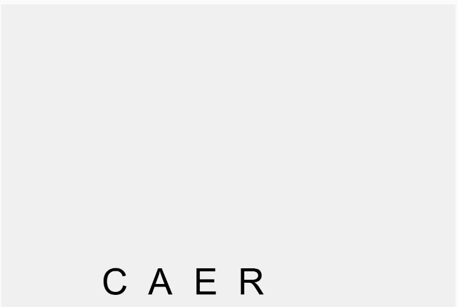
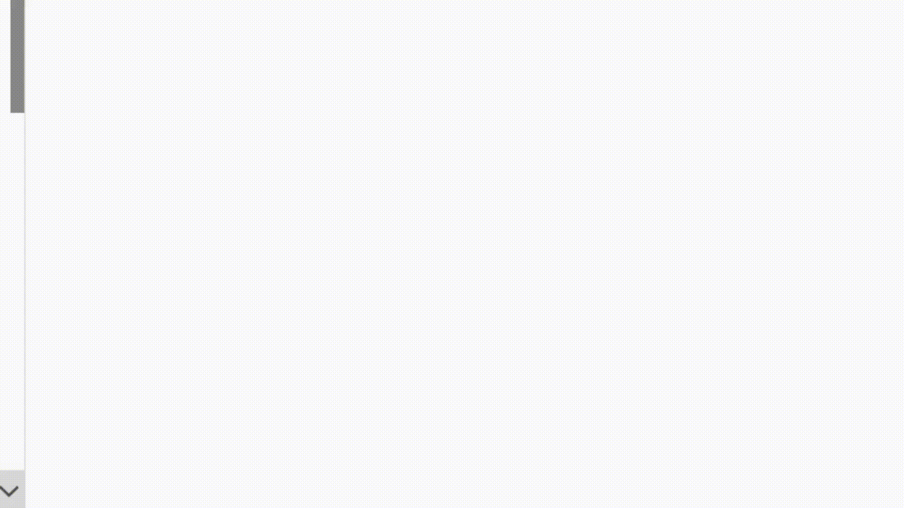

### Palabra Elegida

"CAER"

#### Idea conceptual:
La palabra "Caer" se desarma al comenzar el sketch: las letras están suspendidas y, al iniciar la simulación, todas se sueltan y caen con gravedad como si fueran bloques sueltos. Esto representa el significado de la palabra de forma literal y visual.

#### Aspectos técnicos clave:
- La palabra es un cuerpo de Matter.js
  
- Se usa gravedad para que las letras caigan al suelo.

- Las letras colisionan entre sí y con el suelo.

- Se configura un suelo estático con isStatic: true.

- Se usan propiedades como restitución (rebote) y fricción para dar más naturalidad.

- No usamos restricciones en este caso porque no queremos que las letras estén unidas.

#### Código:

``` js
// Librerías de Matter.js
// Recuerda incluir este enlace en el HTML del editor de p5.js
// <script src="https://cdnjs.cloudflare.com/ajax/libs/matter-js/0.17.1/matter.min.js"></script>

let Engine = Matter.Engine,
    World = Matter.World,
    Bodies = Matter.Bodies;

let engine;
let world;
let letras = [];
let suelo;

function setup() {
  createCanvas(600, 400);
  engine = Engine.create();
  world = engine.world;

  // Suelo
  suelo = Bodies.rectangle(width / 2, height + 10, width, 40, {
    isStatic: true
  });
  World.add(world, suelo);

  // Posiciones de cada letra de "CAER"
  let palabra = "CAER";
  let startX = 200;

  for (let i = 0; i < palabra.length; i++) {
    let letra = palabra.charAt(i);
    let cuerpo = Bodies.rectangle(startX + i * 50, 100, 40, 60, {
      restitution: 0.4,
      friction: 0.3
    });
    cuerpo.label = letra;
    letras.push(cuerpo);
    World.add(world, cuerpo);
  }
}

function draw() {
  background(240);
  Engine.update(engine);

  fill(0);
  textSize(48);
  textAlign(CENTER, CENTER);

  for (let letra of letras) {
    push();
    translate(letra.position.x, letra.position.y);
    rotate(letra.angle);
    text(letra.label, 0, 0);
    pop();
  }

  // Suelo (invisible visualmente, pero comentado aquí para entender que existe)
  // rectMode(CENTER);
  // fill(100);
  // rect(suelo.position.x, suelo.position.y, width, 40);
}

```

#### Resultado de la simulación



